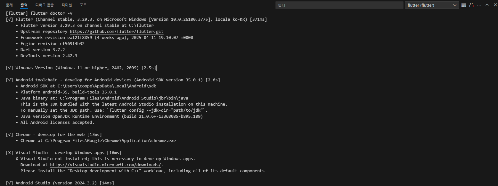

# peanuts_frontend_app
2025년도 동양미래대학교 웹응용소프트웨어공학과 4학년 졸업작품 프로젝트입니다.

# 실행 체크 사항
### 중요 !! Git Clone 하게 된다면 brench는 새로 생성해서 작업 진행해주세요.
### A. Flutter 설치하기 (Window 기준)
1. [Flutter SDK DownLoad](https://docs.flutter.dev/release/archive)

2. Stable channel에서 최신버전 다운로드

3. C드라이브에 압축풀기 ("flutter"폴더만 두기)

4. 환경변수 설정 window창에서 "시스템 환경 변수 편집" 검색

5. 환경변수 -> 사용자 변수 -> 편집 -> 새로 만들기 -> C:\flutter\bin (찾아보기를 통해서 직접 지정 가능)
    

### B. Android Studio 설치하기
1. [Android Studio IDE DownLoad](https://developer.android.com/studio?hl=ko)

2. Plugins 에서 Flutter 설치
   
3. 기존프로젝트나 아무프로젝트를 생성
   
4. Device Manager에서 Create device 클릭
   
5. 개발환경 선택하여 다음버튼 ( 저는 Pixel 2를 사용했습니다. 자세한건 프론트 분들끼리 상의하시면 댈듯합니다. )
    
6. API는 최신버전, settings 에서 Intermal storage는 8GB이상 ↑
    
7. AMD CPU의 경우 오류가 발생하기 때문에 SVM mode를 활성화 해줘야 오류가 나지 않음
자세한 내용은 문의바람 or 구글링을 통해 오류해결가능

### C. Visual Studio 설치하기
1. [Visual Studio IDE DownLoad](https://visualstudio.microsoft.com/ko/downloads/)

***

# 플러터 환경 실행 (Visual Studio Code 기준)
    Ctrl + shift + p (명령 팔레트) = Flutter : Run Flutter Doctor
    > 아래 그림과 같이 나오지않고 !표시가 나온다면 해당내용 해결하여주기
    > 해결이 어렵다면 문의바람

# 안드로이드 디바이스 실행 (Visual Studio Code 기준)
    Ctrl + shift + p (명령 팔레트) = Flutter : Run Emulator
    > 클릭하게 된다면 Android Studio에서 설치한 Device를 선택가능
    > 처음 빌드하게된다면 조금 오래걸림
    > 계속 어두운 화면이 지속된다면 오른쪽 상단에 전원버튼 클릭

# 프로젝트 실행 (Visual Studio Code 기준)
    Ctrl + F5 = 처음 빌드하게 된다면 조금 오래걸림
